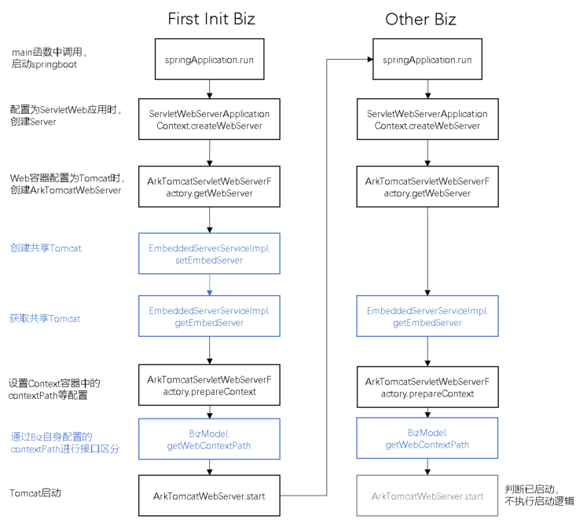

# SOFAArk源码解析-多Web应用合并部署

- [背景](#背景)
- [原生springboot-web应用部署流程](#原生springboot-web应用部署流程)
- [改造支持多Web部署中的关键问题](#改造支持多Web部署中的关键问题)
  - [多Biz共用tomcat实例](#多Biz共用tomcat实例)
  - [多Biz接口区分](#多Biz接口区分)
- [总结](#总结)
## 背景
SOFAArk基于java类加载机制，为我们提供了一种java进程内多模块隔离的方案。每个业务模块——Ark Biz，都是一个完整的springboot项目，可独立运行；也可作为一个maven依赖或远程jar包，引入被称为master Biz的基座Biz，随着master Biz的启动合并部署运行，并由专属的BizClassLoader加载来实现隔离。  
当多个合并部署的Biz为web应用时，则面临着更多的挑战，这里我们可以对比tomcat部署多个webapp的实现，其除了各webapp之间的隔离外，还要保证tomcat众多资源的共享和管控。SOFAArk从0.6.0开始支持基于springboot embedded tomcat的多web应用合并部署，它是如何做到的，是否可以继续扩展支持其它类型web容器应用，下文将会进行具体分析。
## 原生springboot-web应用部署流程
  
我们先从传统的springboot构建的基于内置tomcat的web应用说起。其在运行main函数初始化时，使用TomcatServletWebServerFactory#getWebServer这一工厂方法，创建了一个实现WebServer接口的TomcatWebServer实例，这里的TomcatWebServer实例就是内置tomcat的映射，包括启动、停止等方法。springboot自身还有jetty、netty等WebServer的实现，同样有其对应的工厂方法创建。对应的工厂bean基于springboot的自动装配机制加载。
## 改造支持多Web部署中的关键问题
相较于单纯的springboot应用，一个Ark包的复杂之处在于，它可以包含多个Ark Biz，其中每个Ark Biz都是一个完整的springboot项目。因此使用内置tomat启动时会面临以下问题：
1. 多个Biz(springboot项目)需要共用一个tomcat实例
2. 需要像传统tomcat下部署多webapp一样，通过添加前缀的方式区分不同Biz的http接口

因此sofa-ark对springboot的相关实现做了替换，具体如下
|sofa-ark|springboot|
|---|---|
|ArkTomcatServletWebServerFactory|TomcatServletWebServerFactory|
|ArkTomcatEmbeddedWebappClassLoader|TomcatEmbeddedWebappClassLoader|
|ArkTomcatWebServer|TomcatWebServer|
### 多Biz共用tomcat实例
针对第一个问题——多个Biz要共用一个tomcat实例，sofa-ark定义了EmbeddedServerService接口，并使用其插件机制来扩展，插件为web-ark-plugin，里面包含了EmbeddedServerService的实现EmbeddedServerServiceImpl，来持有公共tomcat实例。
````
package com.alipay.sofa.ark.web.embed.tomcat;
//作为ark plugin导出
public class EmbeddedServerServiceImpl implements EmbeddedServerService<Tomcat> {
    //共享tomcat
    private Tomcat tomcat;
    private Object lock = new Object();

    @Override
    public Tomcat getEmbedServer() {
        return tomcat;
    }

    @Override
    public void setEmbedServer(Tomcat tomcat) {
        if (this.tomcat == null) {
            //通过加锁，避免多Web Biz并发启动加载时重复创建tomcat实例
            synchronized (lock) {
                if (this.tomcat == null) {
                    this.tomcat = tomcat;
                }
            }
        }
    }
}
````

如果Biz引入了web-ark-plugin，则在ArkTomcatServletWebServerFactory中注入EmbeddedServerServiceImpl，持有第一个初始化的Biz调用getWebServer创建的Tomcat实例(TomcatWebServer的核心)，并在后续初始化的其它Biz调用getWebServer获取tomcat实例时，返回持有的同一个实例，以此来保证多个Biz运行在同一个tomcat中。
````
package com.alipay.sofa.ark.springboot.web;
//每个Web Biz启动中会创建一个自己的该类实例
public class ArkTomcatServletWebServerFactory extends TomcatServletWebServerFactory {

    @ArkInject
    private EmbeddedServerService<Tomcat> embeddedServerService;
	//每个Web Biz启动中调用一次
    @Override
    public WebServer getWebServer(ServletContextInitializer... initializers) {
        if (embeddedServerService == null) {
            // 未依赖web-ark-plugin插件，找不到EmbeddedServerService实现注入时，与原生springboot embedded tomcat实现保持一致
            return super.getWebServer(initializers);
        } else if (embeddedServerService.getEmbedServer() == null) {
            // 最先启动的biz(2.0.0版本之后为master biz)运行时，tomcat实例还未创建，初始化一次
            embeddedServerService.setEmbedServer(initEmbedTomcat());
        }
        // 多个biz公用同一个tomcat
        Tomcat embedTomcat = embeddedServerService.getEmbedServer();
        prepareContext(embedTomcat.getHost(), initializers);
        return getWebServer(embedTomcat);
    }
}
````
### 多Biz接口区分
对于第二个问题——区分不同Biz的http接口，独立运行的tomcat是通过contextPath这一配置来实现的，每个webapp设置不同的contextPath，作为不同webapp接口的前缀，例如server.xml中可以做如下配置
````
<context path="test1" docBase="~/Documents/web1/" reloadable = true>
<context path="test2" docBase="~/Documents/web2/" reloadable = true>
````
默认情况下使用war包解压后的文件夹名作为其contextPath。  
springboot中可使用以下方式指定contextPath，默认为""，一个springboot项目只能指定一个。
````
server:
  servlet:
    context-path: /myapp1
````
因此对于sofa-ark而言，参考了独立tomcat的实现方式，基于contextPath区分，并对springboot的内置tomcat实现做了改造，每个Biz均是如下流程：  
1、在其MANIFEST文件中配置web-context-path属性的值作为其contextPath，例如：

````
Manifest-Version: 1.0
web-context-path: another
````
2、在调用BizFactoryServiceImpl的createBiz方法创建BizModel时，设置到该Biz的BizModel对象中
````
package com.alipay.sofa.ark.container.service.biz;

@Singleton
public class BizFactoryServiceImpl implements BizFactoryService {
    //基于Biz的jar包创建Biz
    @Override
    public Biz createBiz(BizArchive bizArchive) throws IOException {
        BizModel bizModel = new BizModel();
        //读取MANIFEST文件
        Attributes manifestMainAttributes = bizArchive.getManifest().getMainAttributes();
        bizModel
            .setBizState(BizState.RESOLVED)
            .setBizName(manifestMainAttributes.getValue(ARK_BIZ_NAME))
            .setBizVersion(manifestMainAttributes.getValue(ARK_BIZ_VERSION))
            //contextPath设置
            .setWebContextPath(manifestMainAttributes.getValue(WEB_CONTEXT_PATH))
            .setClassPath(bizArchive.getUrls());
        //专属BizClassLoader创建
        BizClassLoader bizClassLoader = new BizClassLoader(bizModel.getIdentity(),
            getBizUcp(bizModel.getClassPath()), bizArchive instanceof ExplodedBizArchive
                                                || bizArchive instanceof DirectoryBizArchive);
        bizClassLoader.setBizModel(bizModel);
        bizModel.setClassLoader(bizClassLoader);
        return bizModel;
    }
}
````
3、随后在ArkTomcatServletWebServerFactory的prepareContext方法中，为每个Biz创建其Context时，设置其对应的contextPath。
````
package com.alipay.sofa.ark.springboot.web;

public class ArkTomcatServletWebServerFactory extends TomcatServletWebServerFactory {

    @ArkInject
    private BizManagerService             bizManagerService;
    @Override
    protected void prepareContext(Host host, ServletContextInitializer[] initializers) {
        StandardContext context = new StandardContext();
        context.setName(getContextPath());
        context.setPath(getContextPath());
        host.addChild(context);
    }
    @Override
    public String getContextPath() {
        String contextPath = super.getContextPath();
        //基于当前正在使用的BizClassLoader找到对应的Biz
        Biz biz = bizManagerService.getBizByClassLoader(Thread.currentThread()
            .getContextClassLoader());
        if (!StringUtils.isEmpty(contextPath)) {
            //优先使用springboot原生配置
            return contextPath;
        } else if (biz != null) {
            //如果Biz没有配置，默认为根目录""
            if (StringUtils.isEmpty(biz.getWebContextPath())) {
                return ROOT_WEB_CONTEXT_PATH;
            }
            //Biz有显式配置，则使用Biz
            return biz.getWebContextPath();
        } else {
            return ROOT_WEB_CONTEXT_PATH;
        }
    }
}
````

## 总结
针对合并部署这一SOFAArk主要特性，Web应用相对于普通应用，首先需要共享相同的web容器实例(tomcat、jetty、netty等)；此外需要对contextPath等Biz专属的上下文配置做好隔离；最后针对不同web容器，以插件的方式提供扩展支持。  
随着Webflux应用越来越广泛，SOFAArk后续也会按照上述思路，对其使用的netty服务器进行合并部署支持，敬请期待。